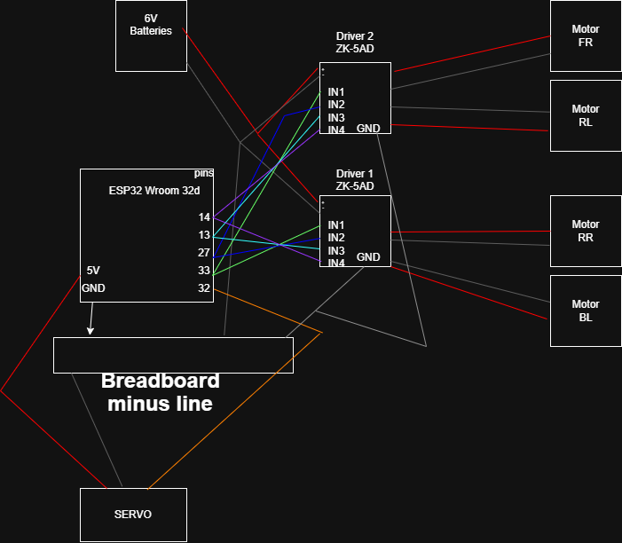

Our Football Robot (Infomatrix Asia)
Hi everyone! This is the project our team built for the robot football competition.

How we built it:
Brains: We went with the ESP32 Wroom 32D.
Movement: The robot has 4 motors. To make sure it has enough power to move fast and push the ball, we used two ZK-5AD drivers. We wired them in parallel so the left and right sides are perfectly synced.
Kicker: We added a servo on pin 32. It’s basically a small lever that hits the ball when we press a button on the phone.
Wiring & Pins:
We drew the circuit diagram in Draw.io (it's in the repo) to keep track of all the wires:
Motors: Controlled with pins 33, 27, 13, and 14.
Kicker: Servo signal is on pin 32.
Power: We are using a battery pack.We connected all GND wires together, otherwise, the signals were all over the place.
Controls:
We use a Bluetooth Serial app to drive it.
F / B for forward and back.
L / R for spin turns (tank mode).
Y to trigger the kicker and score!
It was a lot of trial and error with the wiring and code, but it's finally working and it's pretty fast.

